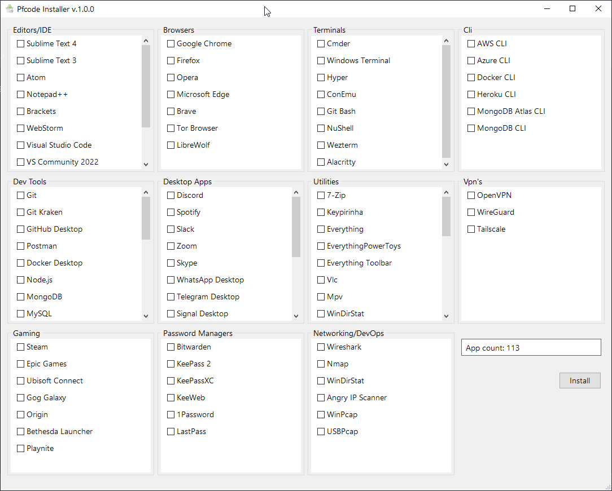

# Pfcode Installer



A simple Windows GUI to install software on a new machine or VM, built with powershell.

There is 100+ packages to choose from.

The app leverage the package manager chocolatey to find and install packages.

There is a standalone ```.exe``` if you trust the code behind it, if you don't you need to build it for yourself, as most antivirus will throw a red flag as a virus.

Alternatively, you can run the script manually from the CLI

```PowerShell
.\pfcode-installer.ps1
```

# Add new chocolatey packages

You can edit the ```config.json``` file and add new

Example, you want to add ```microsoft net framewrok```

1- Go to [https://community.chocolatey.org/packages](https://community.chocolatey.org/packages)

2- Search for ```net framework``` package

3- Copy the name of the package ```dotnetfx```

4- Add the package to an existing section in the json file

```json
 "utils": [
    {
        "name": "Net Framework 4.8",
        "package": "dotnetfx",
        "install": false
    },
]
```

# Flag package for installation

In ```config.json``` you need use ```install: true```

```json
"editors": [
    {
        "name": "Sublime Text 4",
        "package": "sublimetext4",
        "install": true
    },
    {
        "name": "Sublime Text 3",
        "package": "sublimetext3.app",
        "install": true
    },
]
```


